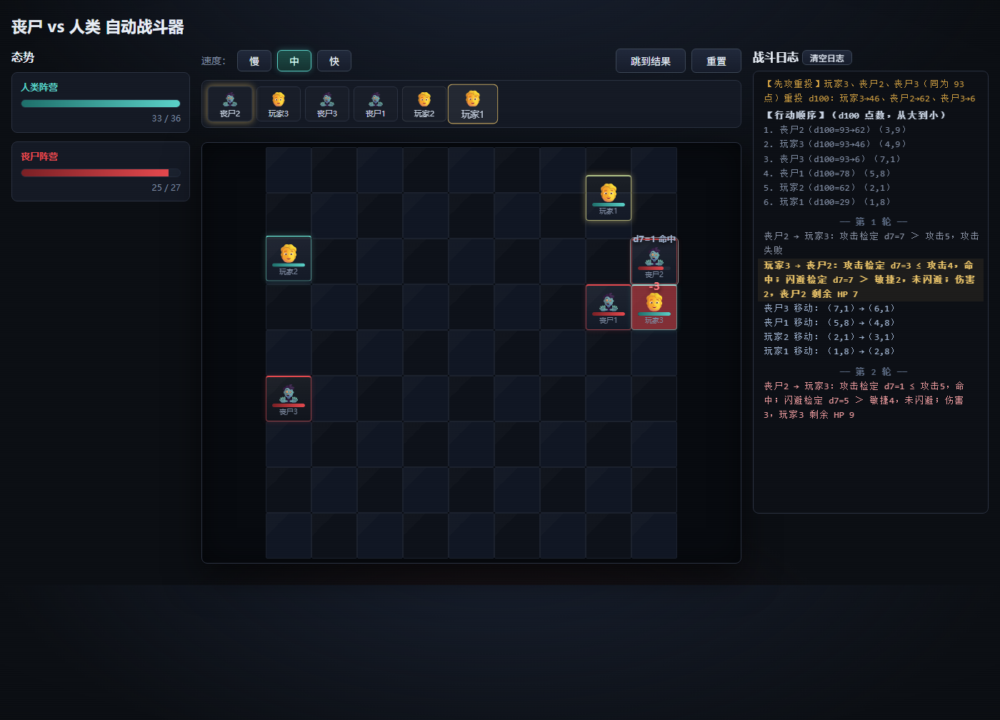
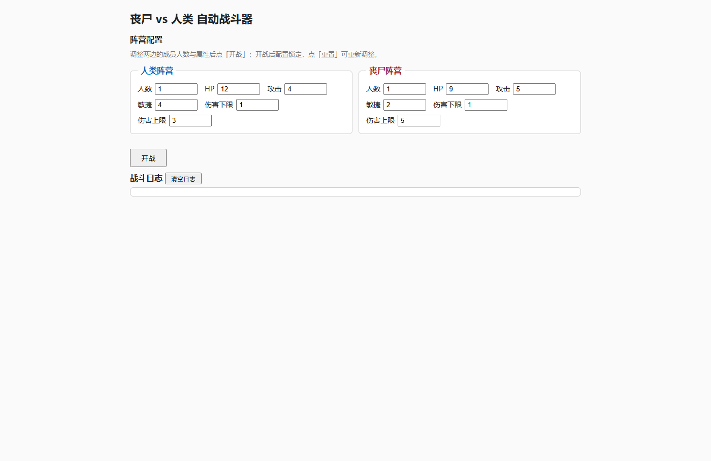
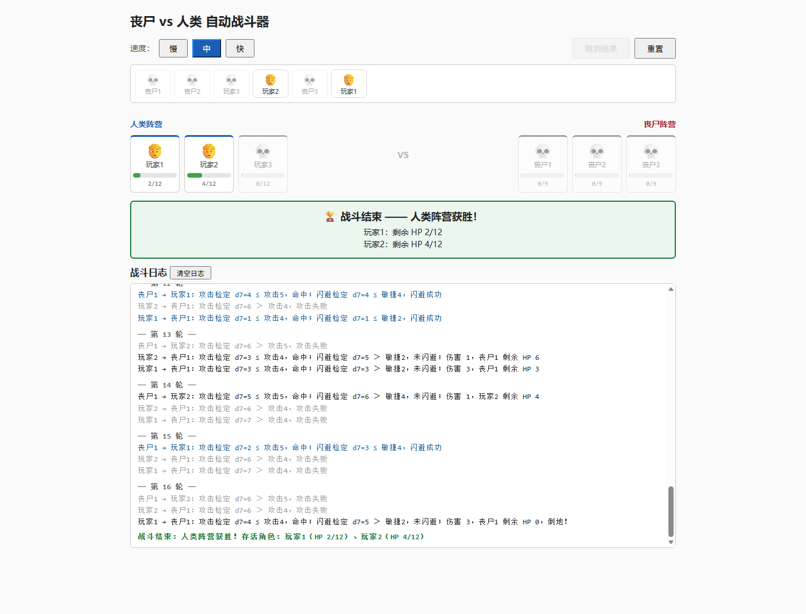
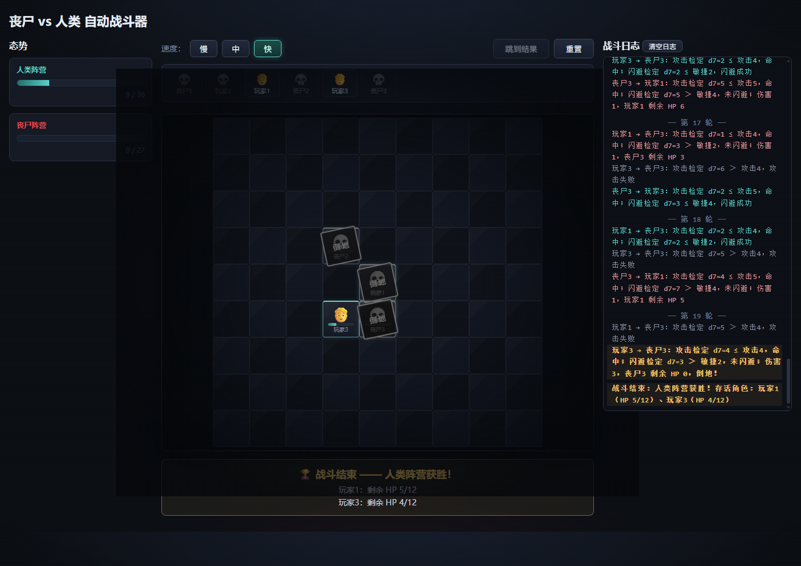

# 🧟 丧尸 vs 人类 · 自动战斗器


> 配置两方阵营，点下「开战」，然后抱臂围观：角色们在 9×9 战场网格上按初始站位散开，掷 d100 定行动顺序，不相邻就向最近的敌人移动一格，挨上了才动手——攻击检定、闪避检定、区间伤害全由骰子说话。飘字报点、血条过渡、卡片滑行，整场战斗逐行动实时演出，日志逐条同步。



## ✨ 亮点

- 🎯 **贴身肉搏的网格战场** —— 9×9 战场网格，初始站位随机散布（全图混抽，或阵营分区左右对峙）；不相邻就只能挪一步，相邻才能攻击。
- 🎲 **全自动骰子战斗** —— 行动顺序 d100、攻击检定 d7、闪避检定 d7、伤害区间随机取值，全程掷骰，你只管围观。
- 🎬 **逐行动实时演出** —— 骰点 / 闪避 / 伤害以飘字出现在角色头顶，受击闪红震动，血条平滑过渡，移动卡片滑入新格；顺序带随时标出轮到谁。
- ⏩ **节奏你说了算** —— 慢 / 中 / 快三档随时切换，长战斗一键「跳到结果」直达终局。
- 🔬 **同种子，逐条一致** —— 引擎是纯函数集合、随机源可注入：同一颗种子下，「整场一次结算」与「逐步演出」的终局与日志逐条相同。
- 📦 **零依赖、无构建** —— 没有 npm、没有打包器、没有网络请求，双击 `src/index.html` 就开打。

## 🚀 快速开始

```bash
git clone https://github.com/sageri/zombie-battle-game.git
```

然后双击 `src/index.html`。没有安装、没有构建、没有第 3 步。

（不想克隆？GitHub 页面 Code → Download ZIP，解压后同样双击即玩。）

<details>
<summary>📷 更多截图（配置页 / 胜负横幅 / 快速档终局）</summary>

| 配置页 | 胜负横幅 | 快速档终局 |
| :---: | :---: | :---: |
|  |  |  |

</details>

## 🎮 玩法规则

### 阵营与属性

| 阵营 | HP | 攻击 | 敏捷 | 伤害 |
| ---- | -- | ---- | ---- | ---- |
| 丧尸 | 9 | 5 | 2 | 1–5 |
| 人类 | 12 | 4 | 4 | 1–3 |

- 双方默认各 1 人，人数与上表全部属性均可在界面上调整。
- 角色命名自增：人类为「玩家1、玩家2…」，丧尸为「丧尸1、丧尸2…」；每场战斗都从 1 重新编号。
- 调整只在开战前生效：点「开战」进入战场页后所有配置控件禁用（锁定）；战场页点「重置」返回配置页并解除锁定，同时清空上一场的战场与日志。

### 战场与初始站位

- 战场是固定 9×9 = 81 格的网格；坐标记法（行,列），从 1 起，(1,1) 为左上。
- 开战时全体角色随机落位（初始站位），落位互不重复：按创建顺序（玩家1..n、再丧尸1..n）逐人在剩余空格中抽取一格，空格按行列序排列，全部经随机源完成。
- 初始站位两种模式：
  - **混合随机**（默认）：候选为全部 81 格，两阵营混抽——开局就可能贴脸。
  - **阵营分区**：人类限列 1–4、丧尸限列 6–9，中列 5 空置，各自在己方半区 36 格内抽取，形成左右对峙的开局。
- 每边人数上限 36（36+36=72 ≤ 81，战场总能放下）。
- 行动顺序表每行行尾标注该角色的初始坐标，如「1. 玩家1（d100=50）（3,4）」。

### 配置校验（点「开战」时）

- 每边人数至少 1 人（上限 36）。
- HP 1–9999；攻击 0–99；敏捷 0–99；伤害下限 / 上限 0–9999，且下限 ≤ 上限。
- 初始站位取值必须是 `mixed`（混合随机）或 `split`（阵营分区）；缺省按混合随机处理，其余取值（含 null、空串、非字符串）报错。
- 所有值必须是整数。校验不通过时在开战按钮上方显示中文错误信息，不开战。

### 行动顺序

- 开战时全部角色各投一次 d100，按点数从大到小依次行动；顺序在战斗结束前不再变化。
- 点数相同者单独拿出来重投：同点组内每人重投一次 d100，重投点数只在同点组内部比较，组的名次锚定在原点数上（与组外角色的先后由原点数决定，不受重投影响）；若组内重投后仍有点数相同者，仅将这些仍同点者再次重投，直至组内分出先后。每次重投（谁、掷出多少）都逐次写入日志。
- 等价地说：最终顺序 = 各角色「获得的全部 d100 点数序列」按字典序从大到小排序。日志的行动顺序表中，有重投者的点数以「50→70→33」形式列出全部掷骰记录。

### 战斗流程（自动战斗，玩家无操作）

角色只有相邻（上下左右四方向的直接格子）时才能攻击。按固定顺序循环行动；轮到倒地者时不出手、不写日志行，直接轮到下一人，直到一方全部角色倒地。每个行动依次执行：

1. 若四邻中有未倒地敌人：在相邻敌人中等概率随机选 1 名为目标，进入攻击链（2–4）。
2. 攻击检定：投 d7，点数 **大于** 行动者的攻击值 → 攻击失败，行动结束。
3. 闪避检定：投 d7，点数 **小于等于** 目标的敏捷值 → 闪避成功，行动结束。
4. 伤害：在行动者伤害区间 [下限, 上限] 内随机取一个整数（含两端），目标扣减该数值的 HP，行动结束。
5. 若四邻中没有未倒地敌人：向最近的敌人移动一格——候选格为四邻中「界内且无未倒地角色占据」的格子（按行列序枚举）；对每个候选格取「到全体未倒地敌人的曼哈顿距离最小值」，选该值最小的格子，并列时随机选 1；没有候选格时写「无法移动（无路可走）」日志，行动结束。
6. 移动与攻击互斥：每个行动要么攻击、要么移动一格；移动本身不掷攻击/闪避骰，也不造成伤害。

边界语义：

- 攻击值 ≥ 7：d7 不可能大于它 → 攻击必定成功；攻击值 ≤ 0 → 必定失败。
- 敏捷值 ≥ 7：d7 必然小于等于它 → 必定闪避成功；敏捷值 ≤ 0 → 永远无法闪避。
- 伤害下限可配为 0：命中造成 0 伤害时目标 HP 不变，不会因此倒地。
- 攻击只在相邻时发生；移动每次恰一格，只走上下左右，不走斜向。

### 倒地与胜负

- HP ≤ 0 即倒地，之后不做出任何行动；倒地立即从战场网格移除——所在格子空出、不再阻挡移动、也不会再被选为目标。
- 界面与日志中倒地角色的剩余 HP 一律显示为 0（不显示负数）。
- 一方全部角色倒地时战斗结束，展示胜利方，以及胜利方每个存活角色的剩余 HP（当前 / 上限）。
- 极端僵局由步数上限强制平局兜底（见附录「设计决策全记录」第 7 条）。

### 日志长这样

真实对局（3v3 混合随机）节选，全文随演出同步滚动：

```text
【行动顺序】（d100 点数，从大到小）
1. 丧尸1（d100=69）（5,8）
2. 丧尸3（d100=59）（8,8）
3. 玩家3（d100=54）（9,4）
4. 丧尸2（d100=39）（6,6）
5. 玩家2（d100=35）（1,1）
6. 玩家1（d100=31）（5,2）
── 第 1 轮 ──
丧尸1 移动：（5,8）→（5,7）
丧尸3 移动：（8,8）→（9,8）
玩家3 移动：（9,4）→（9,5）
……
── 第 3 轮 ──
丧尸3 → 玩家3：攻击检定 d7=4 ≤ 攻击5，命中；闪避检定 d7=6 ＞ 敏捷4，未闪避；伤害 2，玩家3 剩余 HP 10
玩家3 → 丧尸2：攻击检定 d7=3 ≤ 攻击4，命中；闪避检定 d7=1 ≤ 敏捷2，闪避成功
玩家1 → 丧尸1：攻击检定 d7=2 ≤ 攻击4，命中；闪避检定 d7=2 ≤ 敏捷2，闪避成功
```

- 点「跳到结果」时剩余行动瞬间结算，日志一次性补齐到终局，内容与逐步演出完全一致。
- 「清空日志」按钮可随时一键清空日志显示；战斗仍在演出时，后续行动日志会继续追加。

## 🕹️ 操作方法

1. 双击 `src/index.html` 在浏览器中打开（无需服务器、无外部依赖）。
2. 配置页：在「阵营配置」两栏中分别调整人类 / 丧尸的人数与属性，并在「初始站位」下拉中选择混合随机 / 阵营分区（校验规则见上）。
3. 点「开战」：配置立即锁定并进入战场页——9×9 战场网格上全体角色按初始站位散布，卡片为 Emoji + 迷你血条（悬停卡片显示名字；人类蓝顶边、丧尸红顶边），顶部顺序带按行动顺序排头像并高亮放大当前行动者（倒地者保留在带内，变为 💀 并灰化半透明）。
4. 观看逐行动演出：相邻时攻击——骰点 / 闪避 / 伤害以飘字出现在相关角色头顶，受击卡片闪红震动，血条平滑过渡；不相邻时向最近的敌人移动一格——卡片平滑滑入新格子；无法移动时行动者头顶提示、日志说明原因；当前行动者的卡片同步以橙色描边标记，日志随演出同步滚动到底。
5. 速度三档「慢 / 中 / 快」随时切换（每步延时 1.6s / 0.8s / 0.3s，默认「中」，切换立即生效）。
6. 点「跳到结果」：演出中任意时刻瞬间结算剩余全部行动直达终局（长战斗 / 极端配置的保险）。
7. 点「重置」：中断演出返回配置页，配置解锁，上一场的战场、日志与横幅全部清空（不保留历史战斗记录）。
8. 终局：战场页出现胜负横幅（🏆 胜利方 + 胜利方每个存活角色的剩余 HP；平局为橙色横幅说明）。

## 🎲 推荐试玩

| 场次 | 配置 | 看点 |
| ---- | ---- | ---- |
| 宿命对决 | 各 1 人，默认属性 | 一对一拼骰运，两步内见分晓 |
| 街头遭遇 | 各 5 人，混合随机 | 散点开局，转角遇到爱 |
| 分区会战 | 各 12 人，阵营分区 | 中列走廊对峙，缓慢推进 |
| 全面混战 | 各 36 人，混合随机 | 72 人塞满 81 格，寸步难行 |

## 🧪 工程设计

战斗引擎与界面完全分离：

- **引擎**（`src/engine.js`，挂载 `window.GameEngine`）：不依赖 DOM 与计时器的纯函数集合，state 全程 JSON 化纯数据；随机源（`createRng(seed)`，mulberry32）与演出调度器均可注入。API 形态、Node 提取测试方法见文件顶部注释块。
- **界面**（`src/ui.js`，挂载 `window.GameUI`）：只做引擎调用与 DOM 渲染，演出时延全部经注入调度器，测试注入同步调度器即可无渲染驱动全流程。
- **同种子一致性**：整场一次性结算与逐行动步进共用同一内部路径与随机数列，「整场 ≡ 逐步」的终局与日志逐条一致——取舍与被否的预计算方案见 [ADR 0001](docs/adr/0001-live-stepwise-execution.md)。

```text
src/
├── index.html   # 入口：双击即玩
├── styles.css   # 全部样式
├── engine.js    # 战斗引擎：纯函数集合（window.GameEngine）
└── ui.js        # 界面层（window.GameUI）：演出驱动
verify/
├── engine.test.mjs      # 引擎门禁：36 万+ 断言，一致性套件执法
├── browser-drive.mjs    # Edge 无头 CDP 实测：零依赖，五步全过 + 截图入库
└── screenshots/         # 浏览器实测证据（也是本页配图）
```

验证命令（改完必跑，见 `AGENTS.md`）：

```bash
node verify/engine.test.mjs     # 引擎门禁：末行 RESULT {"assertions":…,"failures":[]}
node verify/browser-drive.mjs   # 浏览器实测：五步全过，截图重新生成
```

## 📚 文档导航

- [CONTEXT.md](CONTEXT.md) —— 领域术语表（界面文案、日志与文档用词以此为准）
- [ADR 0001 · 逐行动实时执行](docs/adr/0001-live-stepwise-execution.md) —— 为什么是步进演出，而不是预计算整场再照单呈现
- [ADR 0002 · src/ 多文件布局](docs/adr/0002-multi-file-src-layout.md) —— 单文件不是目标：页面骨架与代码都住在 `src/`

<details>
<summary>📎 设计决策全记录（17 条，含全部数值边界与实现细节）</summary>

1. **数值边界**：人数 1–36 / 每边（9×9=81 格、36+36=72 ≤ 81 的收纳上限）；HP 1–9999；攻击 0–99；敏捷 0–99；伤害下限 / 上限 0–9999 且下限 ≤ 上限；全部必须为整数。初始站位取值仅 `mixed` / `split`（缺省按 `mixed` 处理，向后兼容旧配置形状），其余取值中文报错。校验不通过时显示中文错误信息并拒绝开战。
2. **检定边界语义**：攻击 ≥ 7 必命中、≤ 0 必失败；敏捷 ≥ 7 必闪避、≤ 0 必不闪避（由「d7 与属性值直接比较」自然推出，引擎按此实现并写入规则）。
3. **行动顺序同点重投算法**：同点组单独拿出来组内重投，重投点数只在组内比较（组的名次锚定在原点数上）；组内仍同点者再次重投直至分出，等价于按「点数序列的字典序降序」排序。选择该方案而非「全员点数互不相同」：后者在总人数接近 100 时（d100 只有 100 种点数）收敛极慢甚至因鸽笼原理不可达。每次重投写日志，顺序表中以「50→70→33」展示点数序列。
4. **日志形态**：每个攻击行动合并为一行「行动者 → 目标：攻击检定 …；闪避检定 …；伤害 …，目标剩余 HP …」；移动行动单独成行「X 移动：（r,c）→（r,c）」；无法移动成行「X 无法移动（无路可走）」；轮到倒地者时不写日志行；每轮开始有「── 第 N 轮 ──」分隔行；重投单独成行；行动顺序表每行行尾附初始坐标；日志条目按类型着色（失败灰、闪避蓝、命中深灰、移动绿、受阻橙、胜利绿加粗）。
5. **HP 显示**：倒地角色剩余 HP 显示为 0（不显示负数）；伤害为 0 的命中合法（伤害下限配 0 时），不会击倒目标。
6. **逐行动实时执行与锁定**：开战进入战场页逐行动实时演出（ADR 0001，非整场预计算）；界面驱动引擎逐步结算，演出中配置锁定（配置页不可达、控件禁用）；「重置」中断演出返回配置页并清空上一场战场、日志与横幅；不保留任何历史战斗（无多场战斗管理）。
7. **防死循环安全阀**：引擎设 100000 步行动上限（`GameEngine.MAX_STEPS` 可调），移动步与无法移动步同样计数，达到后强制结束并判为平局（正常配置下不可能触发）；重投另有 10000 次批次上限，超限抛出异常（仅恶意注入固定随机源时可能触发的保险）。
8. **随机源**：界面使用缺省 `Math.random`；引擎提供 `GameEngine.createRng(seed)`（mulberry32）供测试注入可复现随机源；所有掷骰（初始站位抽取 / d100 / d7 / 伤害 / 移动选路）都经注入的 rng 完成，同一随机源下「整场一次性结算 ≡ 逐步执行」含移动路径逐条一致。
9. **命名**：每场战斗从「玩家1 / 丧尸1」重新编号，不跨场延续。
10. **界面样式**：浅色简洁风格（CSS 见 `src/styles.css`）；双栏阵营对照配置（人类蓝 / 丧尸红图例）加「初始站位」全局下拉；战场页为 9×9 战场网格（格子浅灰相间底纹，一格 44px），卡片为阵营顶边色紧凑卡（Emoji + 迷你血条，名字走 `title` 悬停提示），倒地卡片从网格移除而顺序带保留灰化 💀；顺序带与卡片以金色高亮当前行动者，胜负横幅绿色（平局橙色）；日志区等宽字体、可滚动、自动滚到底部；数值用原生 number 输入框（含上下调节按钮）增减。
11. **速度档位**：慢 / 中 / 快 = 每步延时 1600 / 800 / 300 ms，默认「中」；倒地者的空档步与行动一步同延时；切换速度即时生效（已排定的下一步按新延时重排）；开战后首步前静置一档延时，便于看清落位与行动顺序。轻动画时长不随速度档缩放：飘字上浮淡出 0.9s、受击闪红震动 0.5s、血条宽度过渡 0.45s、卡片滑入新格 0.25s、顺序带 / 卡片高亮过渡 0.15–0.2s。
12. **飘字策略**：每步结算先清空全部飘字再写本步飘字（失败 → 行动者头顶「d7=N 攻击失手」；闪避 → 目标头顶「d7=N 闪避成功」；命中 → 行动者头顶「d7=N 命中」+ 目标头顶「-N」/「-N 倒地」；移动 → 行动者头顶「移动」；无法移动 → 行动者头顶「无法移动」）；动画结束后元素留存但已透明，不用计时器移除，由下一步或终局清场。
13. **当前行动者标记**：除顺序带高亮放大外，战场卡片以橙色描边同步标记当前行动者；终局后两处标记均清除。
14. **跳到结果与随机源一致性**：跳到结果用与逐步演出同一个随机源同步排空剩余步，任意时刻跳到的终局与继续看下去完全一致；引擎层同种子「整场一次性结算 ≡ 逐步执行」（终局状态与日志逐条一致，ADR 0001）。界面随机源可经 `GameUI.startBattle(config, rng?)` 注入，缺省 `Math.random`。
15. **调度器注入**：演出延时全部经注入的调度器（契约 `{ setTimeout, clearTimeout, pump?, clear? }`），缺省真实计时；测试用 `GameUI.createSyncScheduler()`（pump 式：手动 `pump(n)` 逐批执行，确定性）；`window.GameUI` 另暴露 `getBattleState / getLogEntries / getMode / getScreen` 等纯数据接口，DOM 桩测试无需真实渲染即可驱动全流程，视觉验证走浏览器 E2E。
16. **日志清空语义**：一键清空只清显示；若战斗仍在演出，后续行动日志照常追加（清空时对齐已渲染进度，不回填旧行）。
17. **终局横幅文案**：「战斗结束 —— X获胜！」+「名字：剩余 HP hp/maxHp」逐行，加 🏆 前缀；平局显示橙色横幅「战斗结束：平局」与说明行。

</details>
